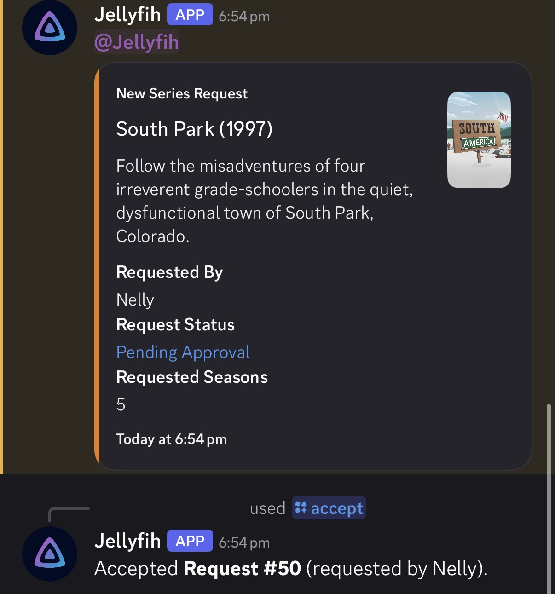

# Jellyseerr Discord bot

A Discord slash-command bot that accepts the newest pending Jellyseerr request
when a server manager runs `/accept`.

This is useful for when you have notifications routed to Discord so you dont
have to login. Rest assured, all but the ping command require the Manage Server
permission.

## Screenshots




## Install with Python

1. Create a Discord application and bot in the
   [Discord Developer Portal](https://discord.com/developers/applications).
   Enable the `bot` and `applications.commands` OAuth scopes, then invite the
   bot to your server.
2. Install Python 3.10 or newer, then place `bot.py` and `requirements.txt`
   in a folder where you can write files. Replace
   `PASTE_YOUR_DISCORD_BOT_TOKEN_HERE` in `bot.py` with your Discord bot token.
3. Open a terminal in that folder and install the dependencies:

   ```sh
   python -m pip install -r requirements.txt
   ```

4. Start the bot:

   ```sh
   python bot.py
   ```

### macOS certificate setup

If Python reports `SSLCertVerificationError` when connecting to Discord and
you installed Python from python.org, run its certificate installer once.
Replace `3.14` with your installed Python version. This step is only for
python.org's macOS installer:

```sh
"/Applications/Python 3.14/Install Certificates.command"
```

Do not disable SSL certificate verification. This certificate installer is
for python.org's macOS installer; other Python distributions manage
certificates differently.

## Connect Jellyseerr

The bot syncs its slash commands on startup; Discord may take a short time to
show them. In the Discord server, run `/setup` with your Jellyseerr base URL
and API key. The bot verifies the connection before saving it. Use `/accept`
to accept the latest pending request.

The Jellyseerr API key is stored unencrypted in `bot_config.sqlite3` beside
`bot.py`. Use HTTPS for remote Jellyseerr instances. The Discord bot token is
hard-coded in `bot.py`; keep that file private and never publish a real token.
If a token is exposed, regenerate it in the Discord Developer Portal.
